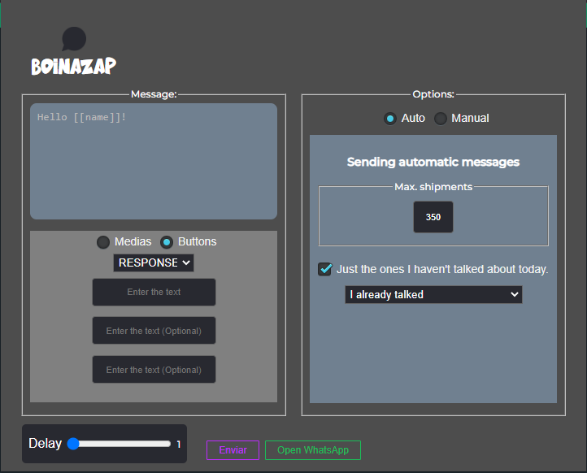

<h1>BulkZap - Envie mensagens, botões e mídias pelo WhatsApp</h1>

  
  
  
  

  

  A extensão do Chrome que permite que você envie mensagens, botões e mídias para seus contatos do WhatsApp com apenas alguns cliques.

  Com o BulkZap, você pode economizar tempo e esforço ao enviar mensagens personalizadas para vários contatos ao mesmo tempo.

  Além disso, o BulkZap oferece recursos avançados, como a possibilidade de enviar mensagens agendadas e criar fluxos de conversas automatizadas.

<h2>Instalação</h2>

Para instalar a extensão, siga as seguintes instruções:

1. Faça o download do repositório em formato .zip ou clone o projeto usando o Git
2. Extraia o arquivo .zip, se necessário
3. Abra o Google Chrome e vá em "Configurações"
4. Clique em "Extensões"
5. Ative o "Modo do desenvolvedor"
6. Clique em "Carregar sem compactação"
7. Selecione a pasta extraída do projeto

<h2>Uso</h2>

Para usar a extensão, basta seguir os seguintes passos:

1. Abra o WhatsApp Web no Google Chrome
2. Clique no ícone do BulkZap ao lado da barra de endereço
3. Selecione os contatos que deseja enviar a mensagem
4. Insira o texto, botões e/ou mídias que deseja enviar
5. Clique em "Enviar" ou "Agendar envio" (caso deseje agendar a mensagem)

<h2>Doações</h2>

Se você gostou da nossa extensão e quer contribuir para o desenvolvimento contínuo do projeto, considere fazer uma doação via PayPal. Seu apoio é muito importante para nós!

